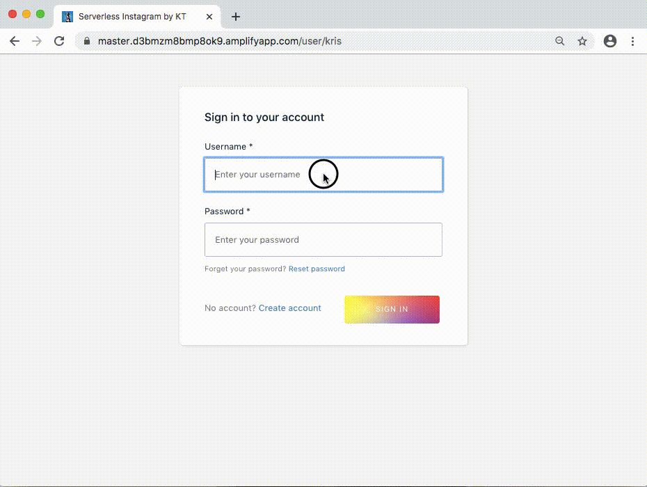

# Rheastagram
Full Stack serverless Instagram clone (named after Rhea, the Lab Mix)

Live Demo: https://rheaprod.d2f7z4fxf9cz8c.amplifyapp.com/

## Overview
* React frontend
* AWS serverless backend

## features/functionality
- [x] Performant Single-Page App (React frontend)
- [x] Auth (Amazon Cognito)
- [x] Storage and uploads (Amazon S3)
- [x] Data persistence / database (Amazon DynamoDB/NoSQL)
- [x] Serverless and flexible API (AWS AppSync/GraphQL)
- [x] Conflict-free styling (Emotion/CSS-In-JS)
- [x] Responsive, modern layout (CSS Grid and Flexbox)
- [x] CRUD operations (create, read, update, and delete User, Posts, and Comments)
- [x] CI/CD (AWS Amplify Console)
- [x] Routing (React-Router)
- [ ] Type-checking (Prop-Types/TypeScript(refactor))
- [ ] Testing (Jest, Enzyme)

## demo gif

## frontend
* React
* Emotion/CSS-In-JS
* Ant-Design components
* AWS Amplify components
* CSS Grid and Flexbox
* React-Icons
* React-Router
* graphql api

## backend
* AWS Amplify
* AWS AppSync (graphql)
* Amazon DynamoDB (NoSQL Database)
* Amazon S3 (Storage)
* AWS Cognito (Auth)